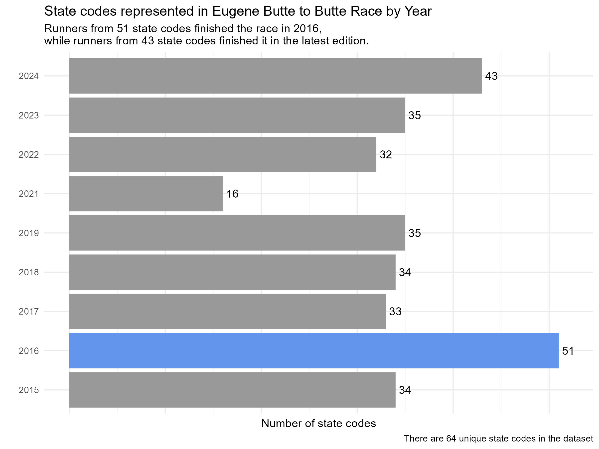
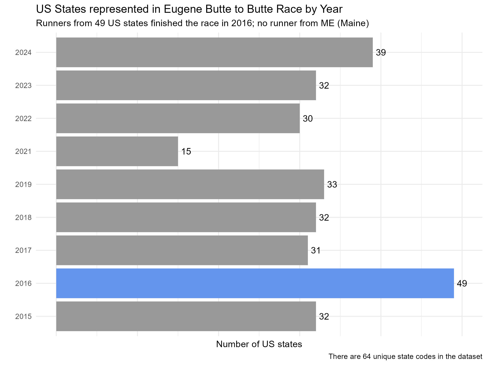

# Eugene [Butte to Butte](https://buttetobutte.com/) Results Data

## Motivation

Living in Eugene, OR, I'm exposed to the vibrant running and track culture in the town. One annual racing event is the Butte to Butte run, which takes place around July 4th each year. The two buttes refer to [Spencer Butte](https://en.wikipedia.org/wiki/Spencer_Butte) and [Skinner Butte](https://en.wikipedia.org/wiki/Skinner_Butte). My husband and I decided to participate this year (2024). As I was registering, I stumbled upon a trivia challenge: **in which year (and there's only one) were runners from all 50 states represented in the race?**. Since the race results for each year are available online (dating back 2000 though the race started in 1974), I decided to answer this question using some web-scrapping.  

## Approach

In this project, I scraped the results of the Eugene Butte to Butte race to create a participant-level (de-identified) dataset for all years for which results are public. Then, I used the resulting dataset to find which year had participants from all states. Beyond answering this question, the dataset can be used to explore other race-related questions though I didn't spend much time diving into it.

## Table of Contents

- [Acknowledgments](#acknowledgments)
- [Repository Structure](#repository-structure)
- [Installation](#installation)
- [Data Structure](#data-structure)
- [Results](#results)
- [Relfection](#reflection)
- [License](#license)

## Acknowledgments

I heavily relied on the following resources:

- `rvest` [reference page](https://rvest.tidyverse.org/) by [Hadley Wickham](https://hadley.nz/) 
- SelectorGadget [tool](https://selectorgadget.com/) by [Andrew Cantino](https://github.com/cantino)
- The Rvest & RSelenium [tutorial video](https://www.youtube.com/watch?v=Dkm1d4uMp34) by [Sameer Hijjazi](https://www.youtube.com/@SamerHijjazi)

*Some more thanks:*

- I leaned heavily on StackOverflow and Copilot for troubleshooting, especially when it came to starting a browser with RSelenium and nailing down the webdriver requirements.
- Shoutout to the folks who sparked my interest in web scraping with their mind-blowing examples in class: [Daniel Anderson](https://github.com/datalorax) and [Owen Jetton](https://github.com/ojetton)
- Finally, thanks and love to my husband, [Piyush Amitabh](https://github.com/pamitabh). He not only mentioned the race to me but also encouraged and brainstormed with me throughout, patiently listening to my endless rants.

## Repository Structure

- **data/**: Contains the scraped dataset in CSV format.
- **scripts/**: Includes RMD walkthrough used for web scraping and data processing as well as analysis
- **images/**: Includes images I used in the walkthrough and result plots

## Installation

To run this project, you will need to have R installed on your machine. I used the following packages: 

- Web-scraping: `rvest` and `RSelenium`
- Scraping supporting: `polite`, `netstat`, `binman`, `wdman`
- Data-wrangling: `tidyverse`, `janitor`, `here`

## Data Structure

The resulting data has runner-year-level information for all event formats (10K run, 5K run, 4M walk, 4.5M walk) that took place in given years for thw following years: 2000, 2002-2006, 2009, 2012-2024. No race happened in 2001 and result pages for 2006, 2007, 2010, and 2011 doesn't exist. There are 62,575 rows in total.

The variables are as follows:
- place: int - Place of finish
- sex: chr 
- div: chr - Division in which runner participated (by gender and age-group)
- city: chr - Registered city based on address shared at the time of registering
- state: chr - Registered city based on address shared at the time of registering
- gun_time: chr - Time in min:sec from when the clock started
- net_time: chr - Time in min:sec from when the runner crossed the starting line (only available for later years)
- pace: chr - Runner pace
- sex_place: int - Place of finish in the same sex group
- sex_total: int - Total runners in the same sex group
- div_place: int - Place of finish in the same sex group
- div_total: int - Total runners in the same sex group
- age_graded_score: num - Ratio of a world-class time for a runner's age and gender divided by the runner's actual time (only available for later years)
- start: chr - Time when runner crossed the line in hh:min:sec
- race_format: chr - Race format, one of 10K, 5K, 4M Walk, 4.5M Walk
- race_year: num - Race year

race_year, race_format, place can be used to identify each individual runner.

## Results

Runners from 51 state codes finished the race in 2016, while runners from 49 states in mainland US finished the race in 2016. Though if we count DC, that totals to 50. The discrepancy could be either that someone from Maine registered but didn't finish the race or didn't release their information for public results page. Nevertheless, I answered **2016** and ended up winning a *free registration* for the event. Wohoo! 

We had a fun time at the race - did the 4M walk!!

Edit: The mail from this year's race said 41 states were represented though I got 43 and 39 from my approach - there may also be a definition variation in what we are classifying as a state.  

## Reflection 

### Successes

- Scraping tables in three different formats: static tables using `rvest`, static tables which are text but printed in a table format using `rvest`, and dynamic tables made using JavaScript using `RSelenium`
- Pipeline to scrape 20 web pages which had 2-3 internal links

### Frustrations

- I had a hard time figuring out JavaScript table, but that turned into a learning opportunity
- Realized that state codes were not present in the scraped data for 2014 and before
- There may be differences in what counts as a state

### Further Improvement

- Upon reviewing the scraped data, I noticed that the state information was only available from 2015 onwards, missing from earlier years. Although I could answer the initial question with the existing data, I plan to find another way to obtain the state information in the future.
- Explore trends and uncover other interesting insights from the data

## License

This repository is licensed under the [Creative Commons Attribution 4.0 International License (CC BY 4.0)](https://creativecommons.org/licenses/by/4.0/). You are free to use, share, and adapt the material as long as you provide appropriate credit to the original author.

## Contact

If you have any questions or suggestions, feel free to reach out to me:

- Email: havishak8@gmail.com
- LinkedIn: [Havisha Khurana](linkedin.com/in/havisha-khurana/)

