# [TidyTuesday](https://github.com/rfordatascience/tidytuesday) Learning Challenges
## Motivation

Although I was aware of #TidyTuesday and #RStats, I hadn't tried my hand at them. This summer (July 2024), I decided to dive deeper and hone my visualization and data wrangling skills with new datasets. As a data enthusiast, I'm excited to share my journey through the weekly TidyTuesday learning challenges. This folder contains the datasets I've used, my analysis scripts, and visualizations created along the way. 

## What is TidyTuesday

TidyTuesday is an amazing weekly social data project that encourages us to dive into diverse datasets and practice data wrangling, visualization, and analysis using data science tools. Each week, we get a new dataset to explore, providing endless opportunities to learn and grow.

## Package Acknowledgment

I use the following packages in my workflow: `tidyverse`, `janitor`, `here`, `readr`, `patchwork`, `ggrepel`, `ggtext`, and `showtext`. For each week, I include the new packages I'm trying.

## Repository Structure

- **scripts/**:  Contains Rmd for analyzing the datasets and creating visualizations for each week
- **products/**: Contains finalized products I created

Each file has a date in its name for management purposes.

## Weekly Projects

### July 16 (Week 29)

**Data:** [The English Women's Football (EWF) Database](https://github.com/probjects/ewf-database)

**Packages:** `gganimate`

**Question:** How has the team ranking (teams with highest wins) evolve over time in the Women's Super League Tier 1?

**Approach:** Created a racing bar chart to show team with most wins across seasons

**Interesting finding:** After 2018, a lot of teams changed their names going away from Ladies to Women. For example, Arsenal Ladies/Chelsea Ladies to Arsenal Women/Chelsea Women. That's why the abruptness of the bars seem to stand out.

**Acknowledgment:** I followed this [blogpost](https://www.r-bloggers.com/2020/01/how-to-create-bar-race-animation-charts-in-r/) to learn about racing bars in R. 

### July 23 (Week 30)

**Data:** [American Idol Database](https://github.com/kkakey/American_Idol)

**Packages:** `ggimage`

**Question:** 
1. Which artist's songs were performed by the most contestants in each season of American Idol?
2. What is the relationship between Audition States and Birthplace of Finalist's States?

**Approach:** Created an inforgraphics and contigency plot

### July 30(Week 31)

**Data:** [Internet Movie Database](https://github.com/rfordatascience/tidytuesday/blob/master/data/2024/2024-07-30/readme.md)

**Packages:** `ggstream`

**Question:** What is the distribution of genres featuring "summer" in their titles over time?

**Approach:** Created an aera plot

**Interesting finding:** The word is common in drama and comedy genres, and started appearing in other genres around 2000s.

**Acknowledgment:** Inspired by Gilbert Fontana's visual and followed this [blogpost](https://r-graph-gallery.com/web-stacked-area-chart-inline-labels.html).

### August 6 (Week 32)

**Data:** [Olympics Data](https://www.kaggle.com/datasets/heesoo37/120-years-of-olympic-history-athletes-and-results/)

**Packages:**  `rvest`

**Question:** How has India's journey been in the Summer Olympics?

**Approach:** Wrote a [post](script/tt_august624.html) using Rmd to capture certain details; sharing one image from the post that I really liked.

**Acknowledgment:** I took inspiration from this [blogpost](https://flourish.studio/blog/visualizing-olympics/).

### August 13 (Week 33)

**Data:** [World's Fairs](https://en.wikipedia.org/wiki/World%27s_fair)

**Packages:** `wordcloud`, `tm`, `grid`, `png`

**Question:** What have been the world expo themes?

**Approach:** Look at the most-recurring words in the thme over a period of quarter-century and arranged them like a time-line.

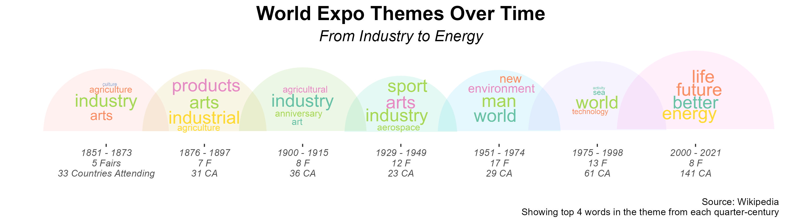

### August 20 (Week 34)

**Data:** [English Monarch Marriage Data](https://github.com/frankiethull/english_monarch_marriages)

**Packages:** `emoji`, `ggcirclepack`

**Question:** What were the common couple first name combinations? If a royal wedding happened, who's probably getting married?

**Approach:** Look at the most-recurring couple first-names across marriages, and common first names of monarch and consort.

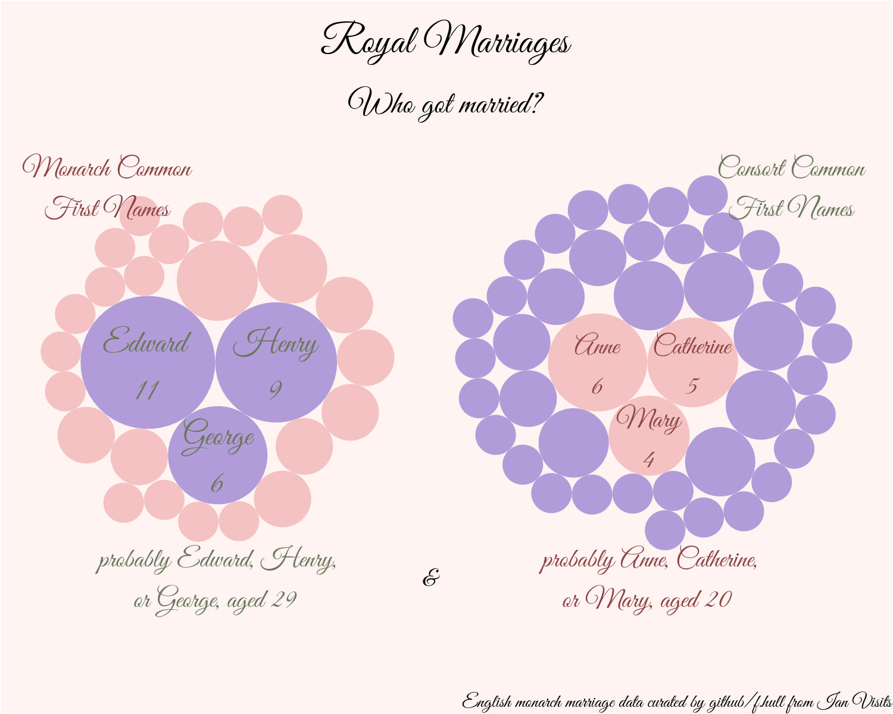

**Acknowledgment:** The second plot is heavily inspired from [this graphic](https://github.com/gkaramanis/tidytuesday/blob/master/2024/2024-week_32/plots/olympics-tt.png) by Georgios Karamanis.

### August 27 (Week 35)

**Data:** [Power Rangers Dataset](https://www.kaggle.com/datasets/karetnikovn/power-rangers-dataset/data)

**Packages:** `tm`

**Question:** Which character names were mentioned across episode description?

**Approach:** Looked for names (those starting with capital letters plus some sorting) in description.

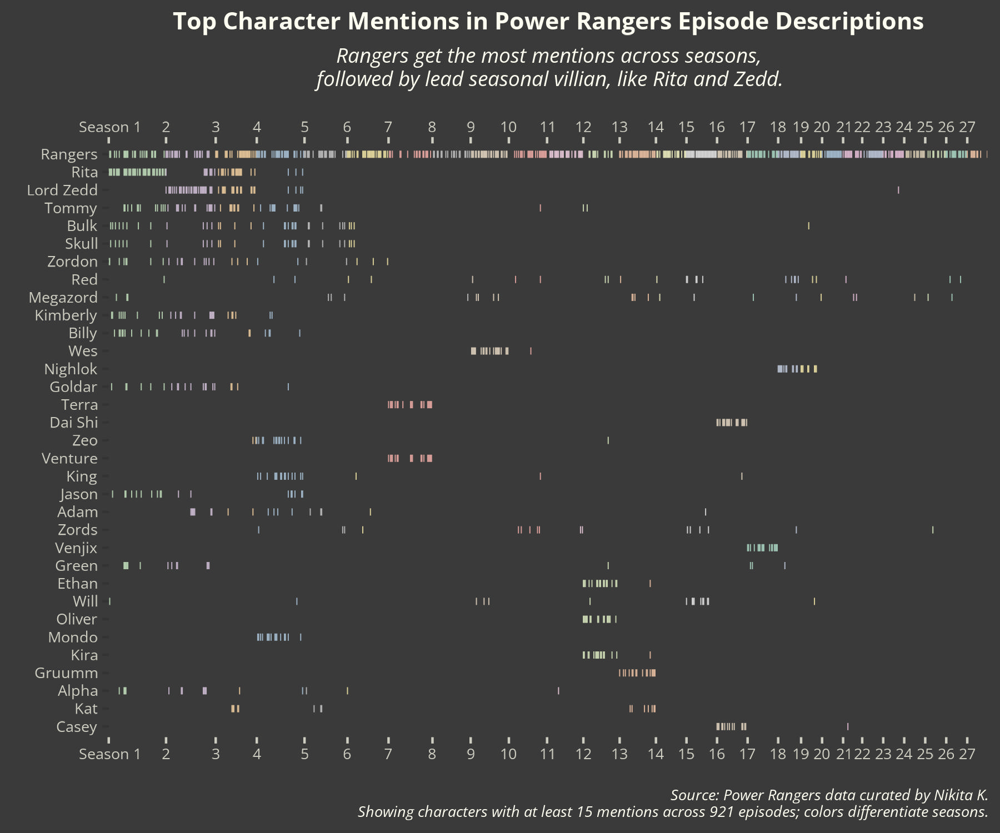

### September 3 (Week 36)

**Data:** [Stack Overflow Annual Package](https://www.kaggle.com/datasets/karetnikovn/power-rangers-dataset/data)

**Packages:** `ggalluvial`

**Question:** What do people across coding skills and industry think about AI?

**Approach:** Summarized proportions by skills/industry and their thoughts on AI.

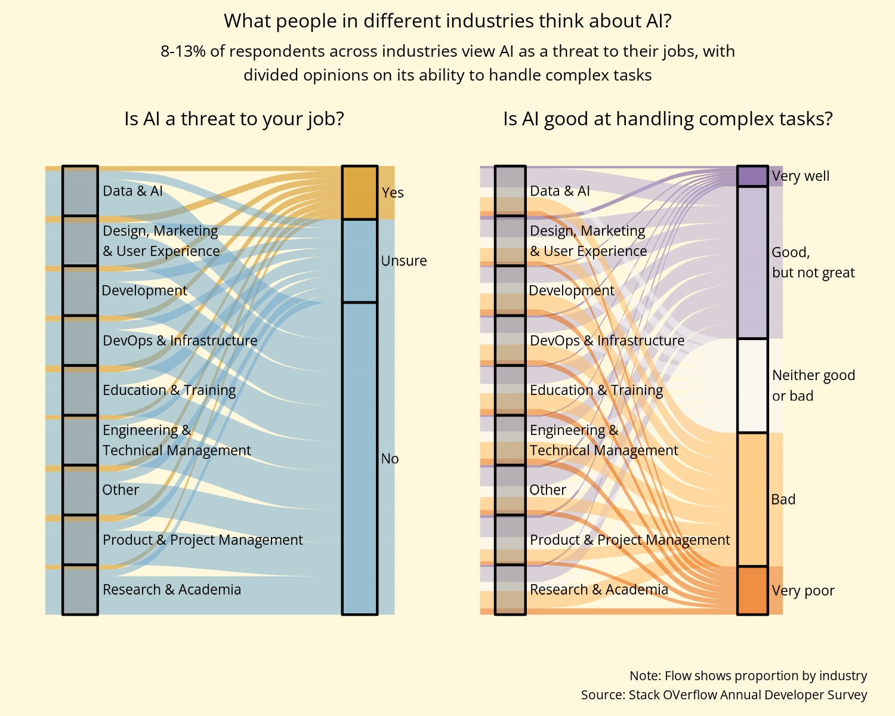

### September 10 (Week 37)

**Data:** [College-Level Data for Selective American Colleges](https://opportunityinsights.org/data/)

**Question:** How do college-attendance rates compare by parent income and college tier? 

**Approach:** Made a heat map.

### September 17 (Week 38)

**Data:** [Shakespeare Dialogue](https://github.com/nrennie/shakespeare)

**Packages:** `syuzhet`, `cowplot`

**Question:** What emotions are reflected in the dialogues of Romeo & Juliet?

**Approach:** Emotion-coded each line and visualized the emotions. Tried some generative art too.

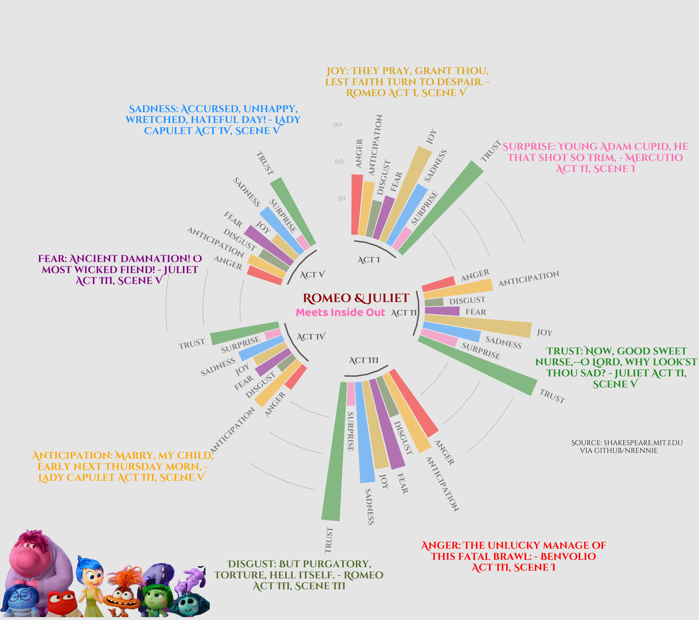

**Acknowledgment:** For the circular plot, I heavily relied on [this tutorial](https://r-graph-gallery.com/297-circular-barplot-with-groups.html) by R Graph Gallery.

### September 24 (Week 39)

**Data:** [International Mathematical Olympiad Data](https://github.com/rfordatascience/tidytuesday/blob/master/data/2024/2024-09-24/readme.md)

*I helped curate this data!*

**Packages:** `ggridges`

**Question:** What problems are key to winning a medal?

**Approach:** Density plots by medal status

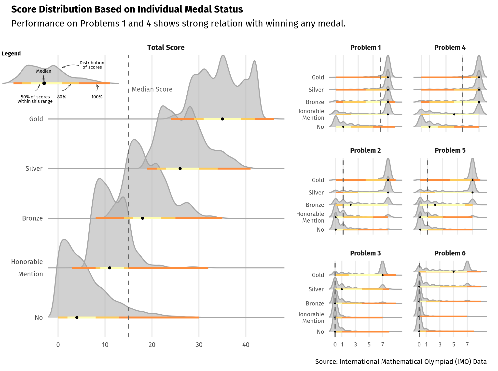

**Acknowledgment:** For the density plot, I was inspired by [this plot](https://r-graph-gallery.com/web-ridgeline-plot-with-inside-plot-and-annotations.html) by Ansar Wolsing, especially the internal legend.

### October 1 (Week 40)

**Data:** [Lichesss Data via Kaggle/Mitchell J](https://www.kaggle.com/datasets/datasnaek/chess/data)

**Packages:** `rchesss`

**Question:** What are some commmon opening moves in chesss game, and which side has a higher win chance with a given opening move?

**Approach:** Displayed chessboard configuration for top 15 most common opening with percentage wins

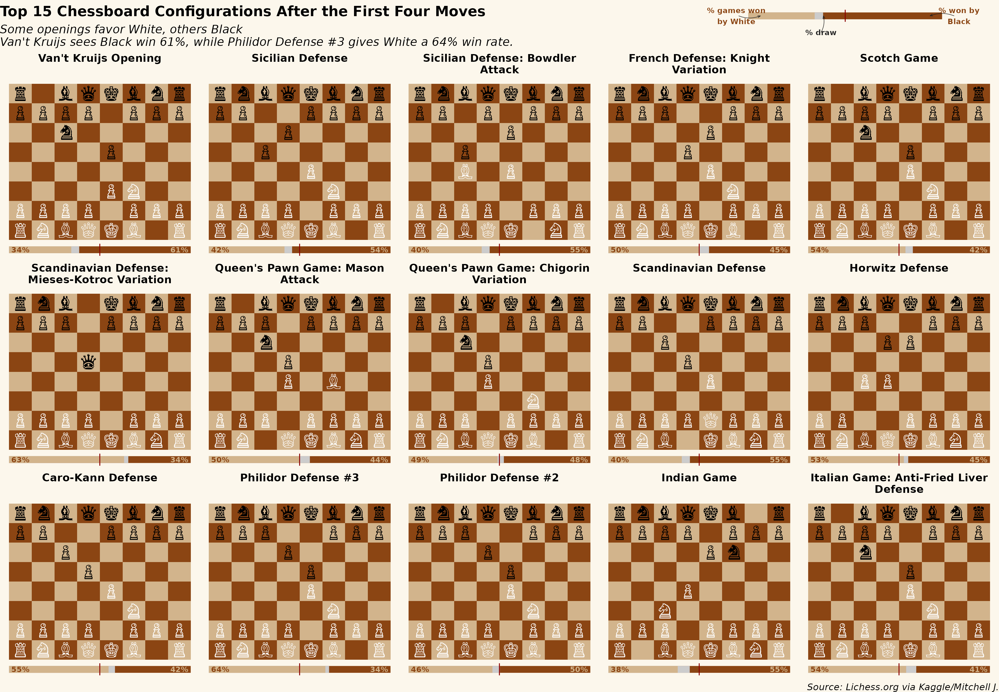

**Acknowledgment:** I learned about plotting chess data using this [post](https://jkunst.com/blog/posts/2015-10-30-visualizing-chess-data-with-ggplot/) by Joshua Kunst Fuentes.

### October 8 (Week 41)

**Data:** [National Park Species]()

**Packages:** `ggraph`

**Question:** What are some ecological patterns across 15 national parks?

**Approach:** Used a circular edge bundling plot to see species coexistant patterns.

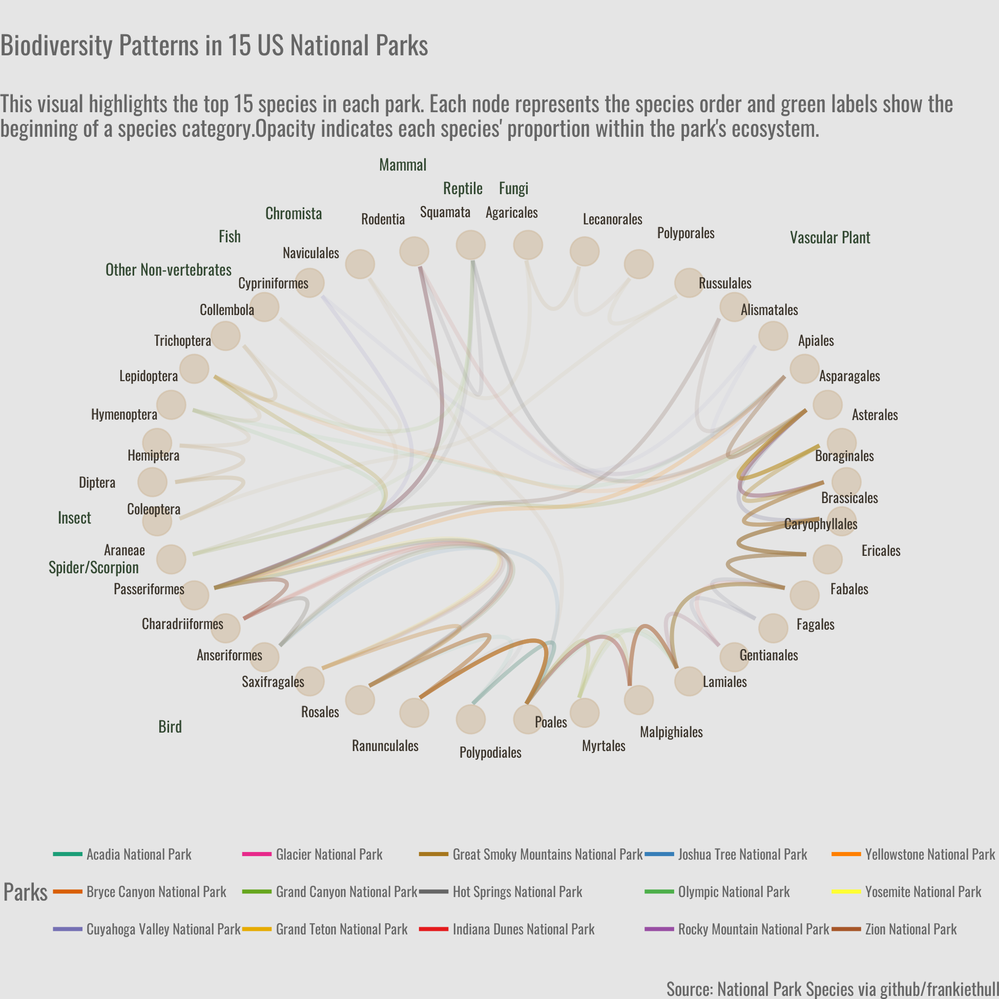

**Acknowledgment:** I followed this [post](https://r-graph-gallery.com/311-add-labels-to-hierarchical-edge-bundling.html) to understand hierarchical edge bundling plot.

### October 15 (Week 42)

**Data:** [Orcas Encounter Data]()

**Packages:** `sf` and `rnaturalearth`

**Question:** What are the monthly orca encounter trends?

**Approach:** Plotted month-wise paths on map around the Salish Sea highlighting the longest encounter.

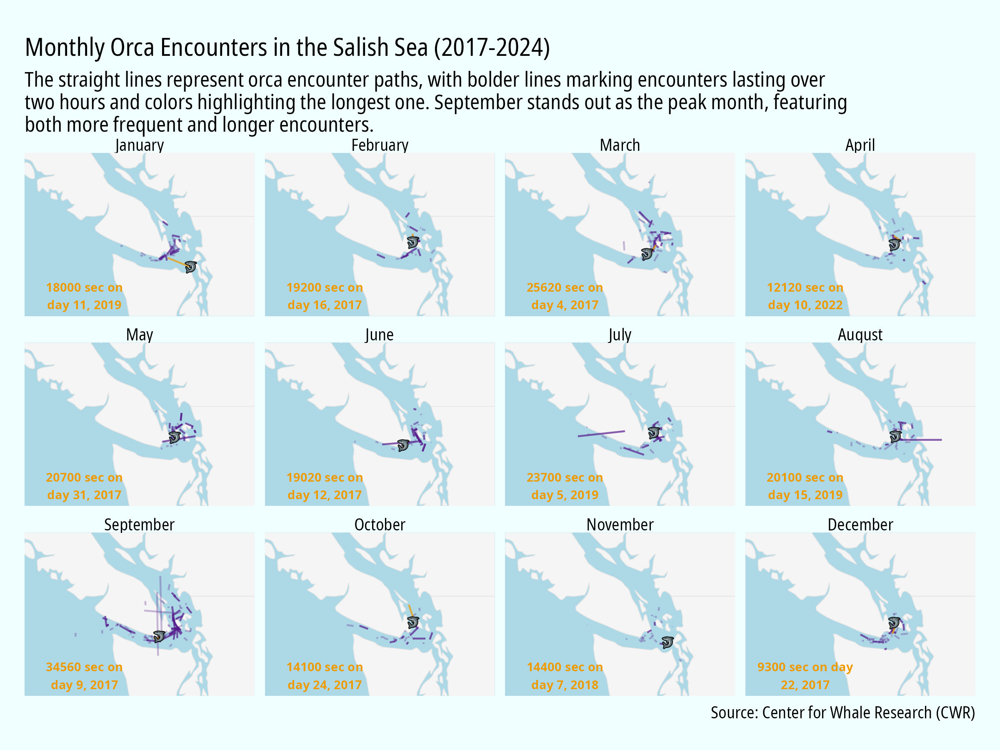

### October 22 (Week 43)

**Data:** [CIA Factbook 2014]()

**Packages:** `sf`, `rnaturalearth`, `stringdist`

**Question:** What percent of a country's population were internet users in 2014?

**Approach:** Bubble map and some fuzzy-matching

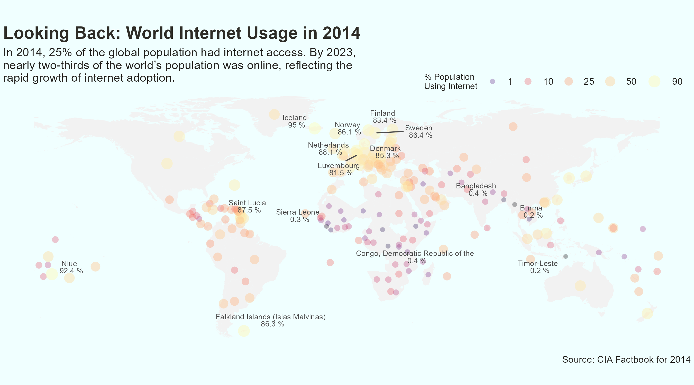

### October 29 (Week 44)

**Data:** [IMBD Halloween Movies]()

**Packages:** `ggbeeswarm`

**Approach:** Some halloween-inspired pumpkin and ghost distributions

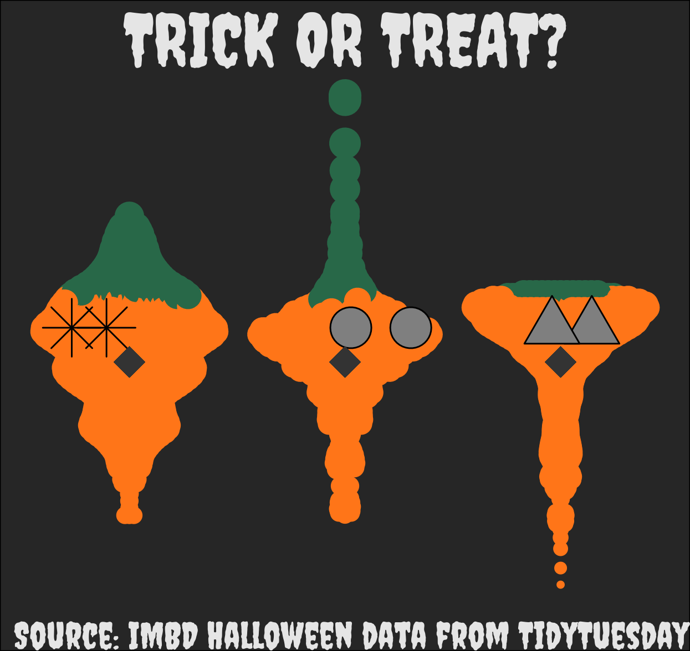

### November 4 (Week 45)

**Data:** [Democracy data]()

**Packages:** ggsankey

**Question:** How has world electoral systems changed over time?

**Approach:** Make a sankey plot showing 4 classification of electoral system over time.

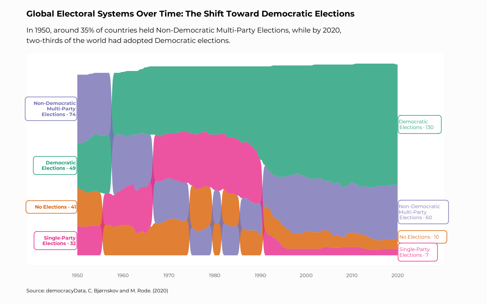

**Acknowledgement:** I was inspired by this [plot](https://github.com/gkaramanis/tidytuesday/tree/master/2024/2024-week_31) from [Georgios Karamanis](https://github.com/gkaramanis) and re-purposed some of the code.

## Contact

If you have any questions or suggestions, feel free to reach out to me:

- Email: havishak8@gmail.com
- LinkedIn: [Havisha Khurana](linkedin.com/in/havisha-khurana/)

