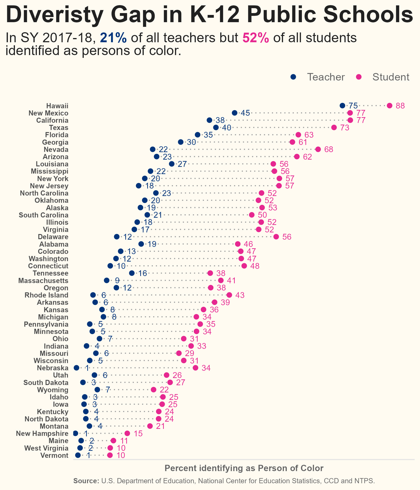
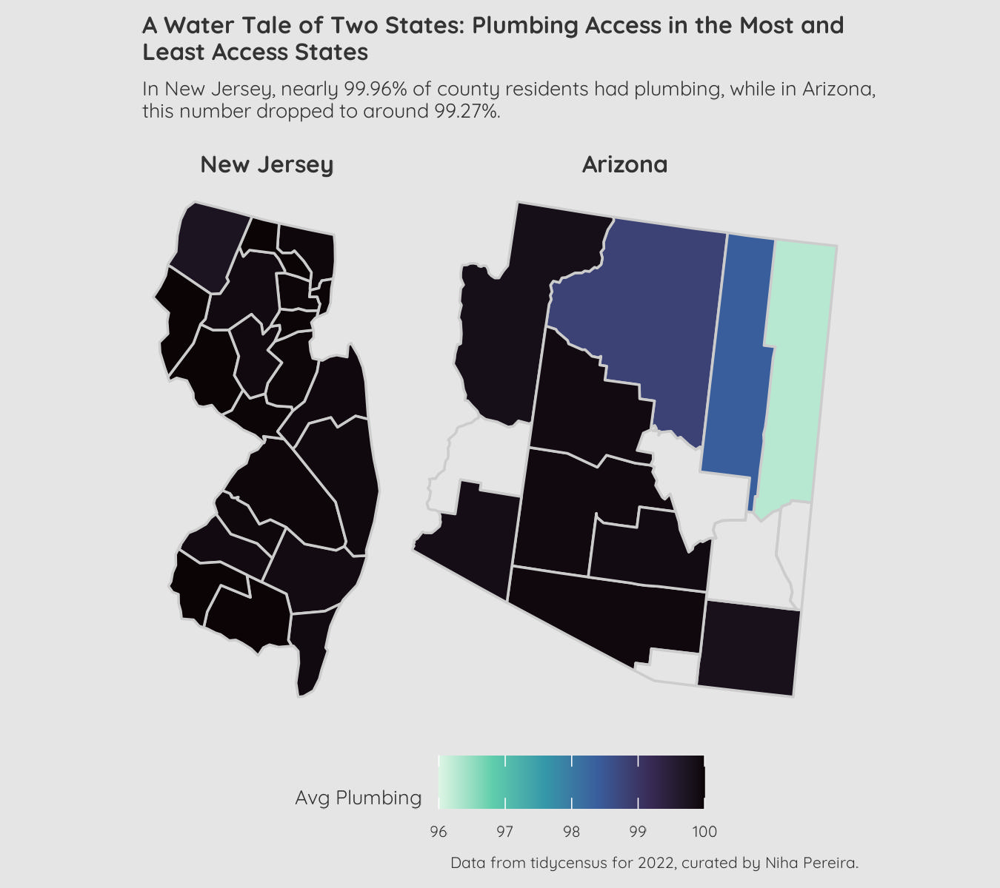
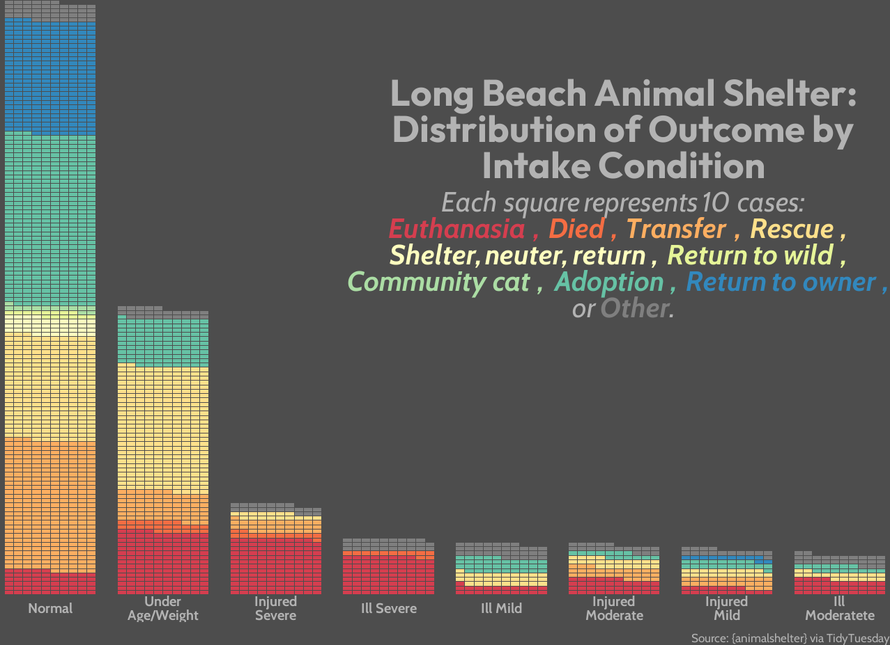
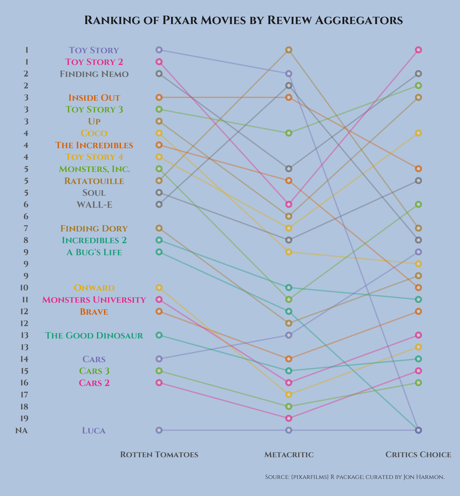
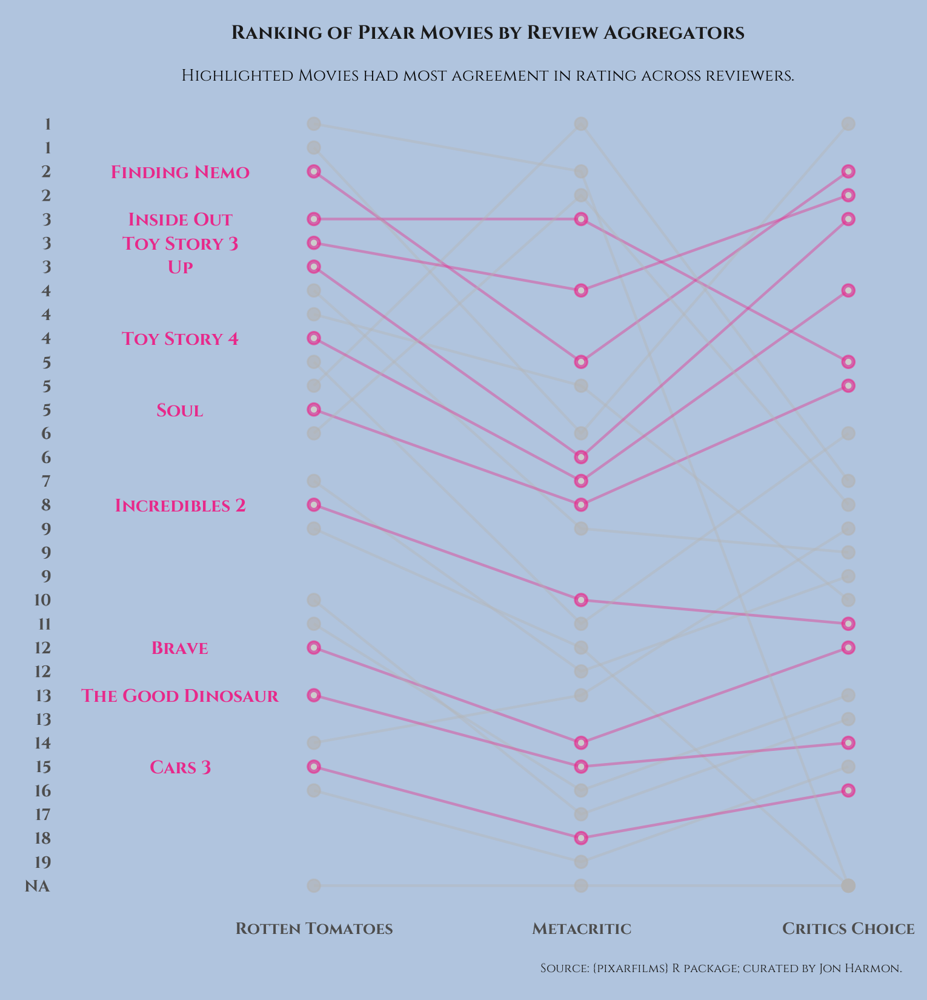
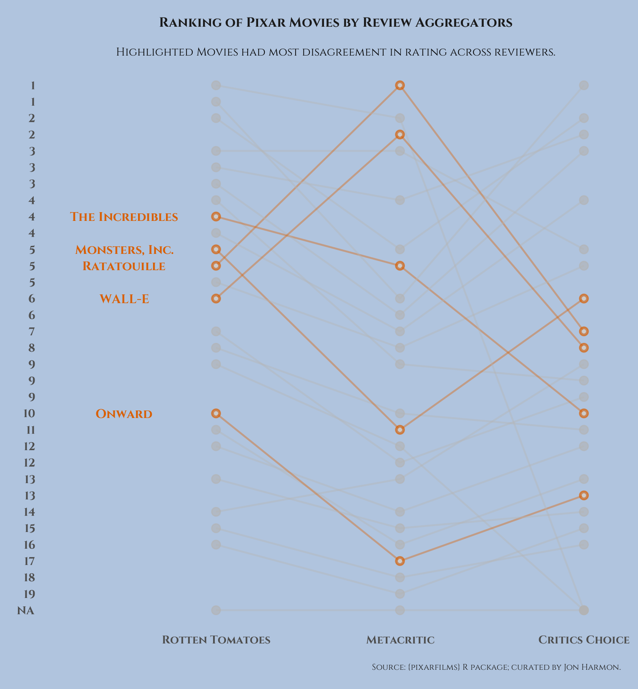

### Weekly Projects - 2025

### Jan 7 (Week 1)

**Data:** Bring your own data, NCES Data on Student and Teacher Demographics

**Question:** How does student and teacher racial demographic characters compare in US states?

**Approach:** Made a dot-plot.

### Jan 28 (Week 4)

**Data:** [Water Insecurity](https://cran.r-project.org/package=tidycensus)

**Question:** How does county-level percentage of plumbing access vary across the state with most and least plumbing access?

**Approach:** Created two state-maps with county-level percentages for plumbing access.

### Feb 4 (Week 5)

**Data:** [Donuts, Data, and D'oh - A Deep Dive into The Simpsons](https://www.kaggle.com/datasets/prashant111/the-simpsons-dataset)

**Question:** What is the proportion of lines by gender across episodes?

**Approach:** Created a proportional bar chart.

### March 4 (Week 9)

**Data:** Long Beach Animal Shelter

**Question:** What is the distribution of outcome types by intake condition?

**Approach:** Created a a waffle plot.

**Acknowledgment:** I took inspiration and code from [this plot in the R Graph Gallery](https://r-graph-gallery.com/web-waffle-for-time-evolution.html) by Muhammad Azhar.  

### March 11 (Week 10)

**Data:** Pixar Data

**Question:** What is the difference in Pixar film rankings by different review aggregators?

**Approach:** Created a series of line plots, highlighting most-agreed and most-disagreed rankings.

