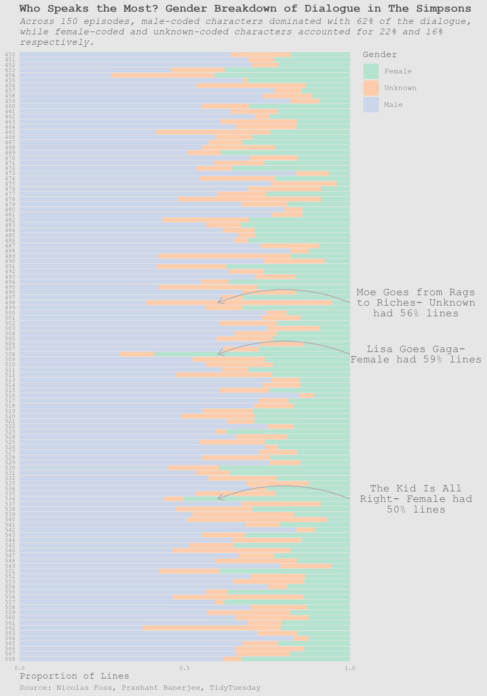

### Weekly Projects - 2025

Jan 28 (Week 4)

**Data:** [Water Insecurity](https://cran.r-project.org/package=tidycensus)

**Question:** How does county-level percentage of plumbing access vary across the state with most and least plumbing access?

**Approach:** Created two state-maps with county-level percentages for plumbing access.

Feb 4 (Week 5)

**Data:** [Donuts, Data, and D'oh - A Deep Dive into The Simpsons](https://www.kaggle.com/datasets/prashant111/the-simpsons-dataset)

**Question:** What is the proportion of lines by gender across episodes?

**Approach:** Created a proportional bar chart.

